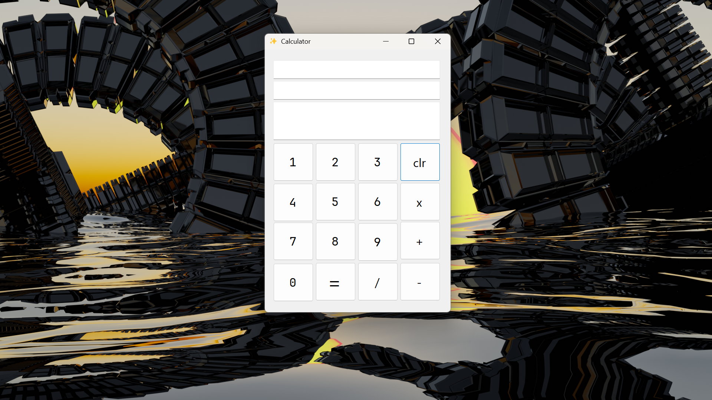

#  Calculator
A simple and functional calculator built using .NET WinForms. Supports basic arithmetic operations with a clean and user-friendly interface.

## 🚀 Features
* Basic arithmetic operations:
  * Addition
  * Subtraction
  * Multiplication
  * Division

## 🛠️ Technologies Used
* .NET Framework
* WinForms (Windows Forms)
* C#
📷
## Screenshot

